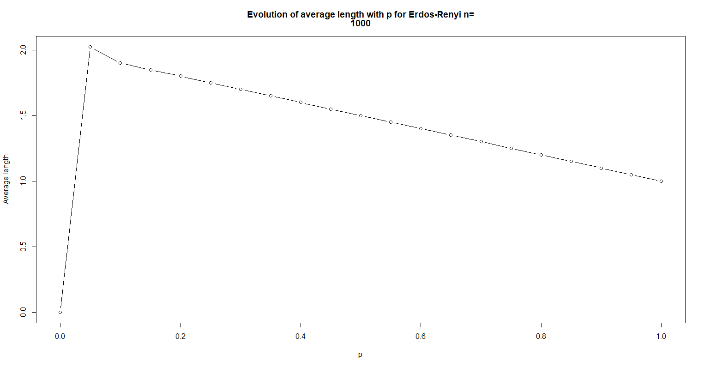

# Erdos-Renyi, average length as function of p

To calculate the average length with the following formula:

$$
l = \frac{2}{n(n-1)}\sum_{1\leq i < j \leq n } d(i,j)
$$

We use the following code :

```r
average_length <- function(igraph)
{
  print(vcount(igraph))
  sum <- 0
  for( i in 1: vcount(igraph) )
  {
    bfs_i <- bfs(igraph,i,
        unreachable = FALSE,
        dist = TRUE);
    for(j in i : vcount(igraph) )
    {
      if( i != j)
      {
        #cat("i:",i,"\t","j:",j,"\tdist:",bfs_i$dist[j],"\n");
        #bfs_i$dist[j] 
        if( !is.nan( bfs_i$dist[j] ) )
        {
          sum <- sum + bfs_i$dist[j]
        }
      }
    }
  }
  l <- 2*sum/( (vcount(igraph)*( vcount(igraph) -1 ))  )
}
```

The evolution of the average length with p is plotted with the following code :

```r
p_average_length <- function(nb_nodes,nb_sample)
{
  p <- 0
  step <- 1/nb_sample
  mat <- vector(mode = "numeric",(2*(nb_sample+1)))
  dim(mat) <- c(2,nb_sample+1)
  for(i in 1: (nb_sample + 1))
  {
    mat[1,i] <- p
    ig <- Erdos_Renyi_optimized(nb_nodes,p)
    mat[2,i] <- average_length(ig)
    p <- p + step
    cat("Progress: ",(i/(nb_sample+1))*100,"%\n")
  }
  strmain <- c("Evolution of average length with p for Erdos-Renyi n=",nb_nodes)
  plot(x = mat[1,],
       y = mat[2,],
       main = strmain,
       type = "b",
       xlab = "p",
       ylab = "Average length",
       )
}
```



