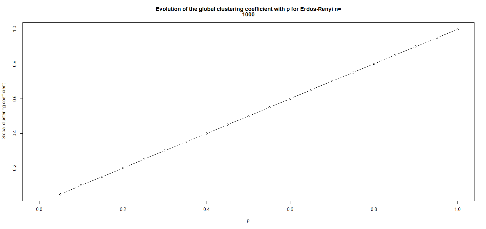

# Erdos-Renyi, clustering coefficient as functions of p

The same principle is applied for evolution of the global clustering coefficient.

```r
p_clustering_coef <- function(nb_nodes,nb_sample)
{
  p <- 0
  step <- 1/nb_sample
  mat <- vector(mode = "numeric",(2*(nb_sample+1)))
  dim(mat) <- c(2,nb_sample+1)
  for(i in 1: (nb_sample + 1))
  {
    mat[1,i] <- p
    ig <- Erdos_Renyi_optimized(nb_nodes,p)
    mat[2,i] <- transitivity(ig)
    p <- p + step
    cat("Progress: ",(i/(nb_sample+1))*100,"%\n")
  }
  strmain <- c("Evolution of the global clustering coefficient with p for Erdos-Renyi n=",nb_nodes)
  plot(x = mat[1,],
       y = mat[2,],
       main = strmain,
       type = "b",
       xlab = "p",
       ylab = "Global clustering coefficient",
  )
}
```



