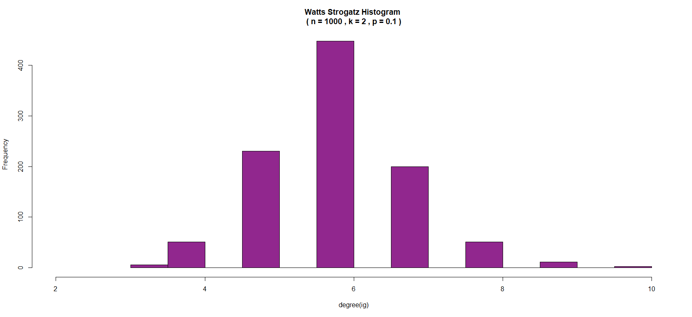
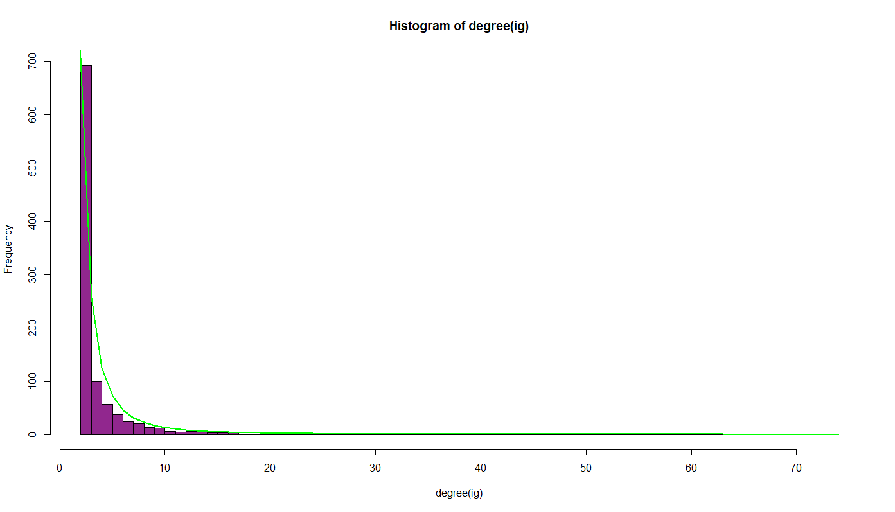

# Histograms of the degree distribution

First, we will generate different graphs with the previous functions:

* Erdos-Renyi with 1000 nodes and different values of the probability $$p$$ from $$0$$ to $$1$$ with a step of $$0.05$$.

To do this we use the following code:

```r
generate_ER <- function(n)
{
  p <- 0
  lst = list()
  for(i in 1:21)
  {
    lst[[i]] <- degree(Erdos_Renyi_optimized(n,p))
    p <- p + 0.05
  }

  find_xmax_histo <- function(lst_deg)
  {
    max_histo <- 0
    for( i in 2: length(lst_deg)-1)
    {
      if( max(lst_deg[[i]]) > max_histo )
      {
        max_x_histo <- max(lst_deg[[i]])
      }
    }
    max_x_histo
  }

  draw_histos <- function(lst_deg,x_max)
  {
    cat("Max histo = ",x_max)
    max_y_histo <- 0
    #for( i in 1: )
    for( i in 2: length(lst_deg)-1)
    {
      strmain <- c('Histogram of Erdos_Renyi for p=',(i-1)*0.05)
      vect_hist <- hist(lst_deg[[i]],
                        main=strmain,
                        xlim=c(0,x_max),
                        breaks=(x_max+2))
      if(max(vect_hist$counts) > max_y_histo )
      {
        max_y_histo <- max(vect_hist$counts)
      }
    }
    max_y_histo
  }
  xmax <- find_xmax_histo(lst)
  draw_histo(lst,xmax)
}
```

We notice the Poisson distribution with the different probability.

* Watts-Strogatz of size $$n = 1000$$ with $$p = 0.1$$ and $$m = 2$$.

  ```r
  Watts_histo <- function(igraph)
  {
  vect_deg <- degree(igraph)
  hsacle <- max(vect_deg) 
  hist(degree(ig),
       main="Watts Strogatz Histogram \n ( n = 1000 , k = 2 , p = 0.1 ) ",
       xlim=c(2,hsacle),
       breaks=(hsacle+2),
       col= rgb(146/256,39/256,143/256)
  )
  }
  ```




* A scale free of size $$n = 1000$$ with $$k = 3$$ and $$q = 2$$.

For this scale free we have added a power law in comparison to verify this law.

```r
customhisto <- function(igraph)
{
  vect_deg <- degree(igraph)
  tot <- sum(vect_deg, na.rm = FALSE)
  hsacle <- max(vect_deg) 
  pow <- powerlaw(100,hsacle)
  hist(degree(ig),
       xlim=c(2,hsacle),
       breaks=(hsacle+2),
       col= rgb(146/256,39/256,143/256)
       )
  lines(pow[2,]*tot,lwd = 2,
  col = "green")
}
```

Here is the code used to create the power law :

```r
powerlaw <- function(hsacle,nbpt)
{
  a <- 2.5
  C <- 1
  step <- hsacle/nbpt

  mat <- vector(mode = "numeric",(2*nbpt))
  dim(mat) <- c(2,nbpt)

  for(i in 1:nbpt)
  {
    mat[1,i] <- i*step
    mat[2,i] <- C*i^(-a)
  }
  mat
}
```



