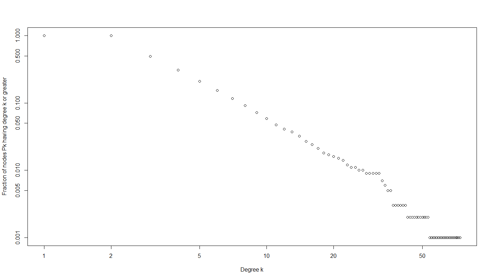

# Scale free, power law degree distribution


To show more clearly the distribution of degree in scale free graph follow power law of type $$P(k) \sim k^{-a}$$

We used a cumulative distribution visualization with the following code :

```r
sortdeg <- function(igraph)
{
  vect_deg <- degree(igraph)
  sorted <- sort.int(vect_deg,decreasing = TRUE)
  sortedind <- sort.int(vect_deg,decreasing = TRUE, index.return = TRUE)

  scale_max <- max(sortedind$x)
  mat <- vector(mode = "numeric",(2*scale_max))
  dim(mat) <- c(2,scale_max)
  for(i in 1: length(sortedind$x))
  {
    mat[2,sortedind$x[i]] <- mat[2,sortedind$x[i]]+1
  }
  for( i in length(mat[2,]):2 )
  {
    mat[2,i-1] <- mat[2,i-1] + mat[2,i] 
  }
  normal <- mat[2,1]
  for( i in 1 : length(mat[2,]))
  {
    mat[1,i] <- i
    mat[2,i] <- mat[2,i]/normal
  }
  max_x <- max(sortedind$x)
  print(max_x)
  plot(mat[1,],mat[2,],
       xlab = "Degree k",
       ylab = "Fraction of nodes Pk having degree k or greater",
       xlim = c(1,max_x),
       ylim = c(0.001,1),
       log ="xy"
       )
  # We may have pb with k = 2.. 
}
```



