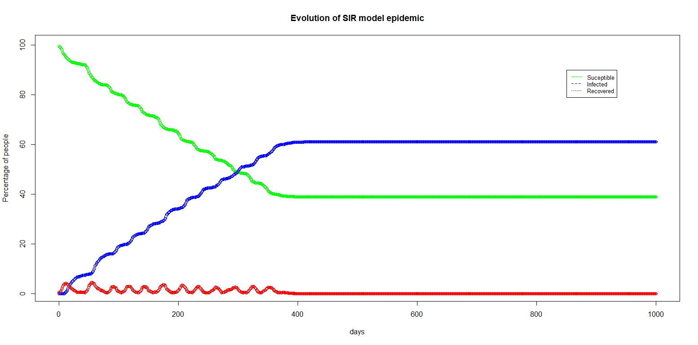

# Effect of confine people

Now we will add rule to limit social links of people. We are trying to simulate the effect of confinement or curfew. The modulization we use is a reduction of the number of edges under certain conditions. The following code simulate this behaving.

```r
library(igraph)

Erdos_Renyi_optimized <- function(n,p)
{
  nb_tri <- n*(n-1)/2
  mat <- diag(0,nrow = n, ncol = n)
  vect_rand <- runif(nb_tri , min = 0, max = 1) - p
  for(i in 1:nb_tri)
  {
    if(vect_rand[i]>0)
    {
      vect_rand[i] <- 0 
    }
    else
    {
      vect_rand[i] <- 1 
    }
  }
  mat[lower.tri(mat)] <- vect_rand
  mat <- t(mat)
  mat[lower.tri(mat)] <- vect_rand
  igraph <- graph_from_adjacency_matrix(mat,mode = c("undirected"))
  igraph
}

plot_epidemic_curves <- function(mat_res,time)
{
  plot( x = c(0:time), y = mat_res[2,],xlab="days",ylab="Percentage of people",type="b",col="green", ylim=c(1,100),main="Evolution of SIR model epidemic")
  lines(x= c(0:time), y = mat_res[3,],type="b",col="blue")
  lines(x= c(0:time), y = mat_res[1,],type="b",col="red")
  legend( ( time-(time*0.15) ), 90, legend=c("Suceptible", "Infected","Recovered"),
          col=c("green","blue","red"), lty=1:3, cex=0.8)
}

epidemic_plot <- function(igraph,mainstr)
{
  nb_node <- vcount(igraph)
  for(i in 1: nb_node)
  {
    node_status <- get.vertex.attribute(igraph,"epidemic", i)
    if( node_status == "i" )
    {
      igraph <- set.vertex.attribute(igraph, 'color', i, rgb(1,0,0) )
    }
    else if (node_status == "s" )
    {
      igraph <- set.vertex.attribute(igraph, 'color', i, rgb(0,1,0) )
    }
    else if(node_status == "r" )
    {
      igraph <- set.vertex.attribute(igraph, 'color', i, rgb(0,0,1) )
    }
    else{
      print("BUG PLOT attribute")
    }
  }
  for(i in 1: nb_node)
  {
    node_status <- get.vertex.attribute(igraph,"i_time", i)

    if( node_status > 0 )
    {
      igraph <- set.vertex.attribute(igraph, "label", i, node_status  )
    }else if( node_status == 0 )
    {
      igraph <- set.vertex.attribute(igraph, "label", i, "R"  )
      igraph <- set.vertex.attribute(igraph, 'color', i, rgb(0,0,1) )
    }else
    {
      igraph <- set.vertex.attribute(igraph, "label", i, "S"  )
    }
  }
  plot(igraph, main = mainstr )
}

is_unique <- function(vect)
{
    isunique <- TRUE
    for(i in 1: length(vect))
    {
        iterator <- vect[i]
        for(j in 1:length(vect))
        {
            if(j != i)
            {
                if(vect[j] == vect[i])
                {
                    isunique <- FALSE
                }
            }
        }
    }
    isunique
}

# The way we ensure uniqueness may be improuved with faster (and nicer) algorithm
ensure_unique <- function(vect){
    while(is_unique(vect) != TRUE)
    {
        for(i in 1: length(vect))
        {
            iterator <- vect[i]
            for(j in 1:length(vect))
            {
                if(j != i)
                {
                    if(iterator == vect[j] )
                    {
                        vect[j] <- floor(runif(1,min=1,max=length(vect)))
                    }
                }
            }
        }
    }
    vect
}

init_epidemic <- function(igraph,n_0,n_d)
{
  nb_node <- vcount(igraph)
  Infected_vect <- floor(runif(n_0,min=1,max=nb_node))
  Infected_vect <- ensure_unique(Infected_vect)

  igraph <- set.vertex.attribute(igraph,"epidemic", value="s")
  igraph <- set.vertex.attribute(igraph,"i_time", value = -1 )
  for( i in 1 : n_0 )
  {
    igraph <- set.vertex.attribute(igraph,"epidemic", Infected_vect[i] ,value="i")
    igraph <- set.vertex.attribute(igraph,"i_time", Infected_vect[i] ,value= n_d )
  }
  stat_days(igraph)
  igraph
}

infected_heal <- function(igraph)
{
  nb_node <- vcount(igraph)
  for( i in 1: nb_node)
  {
    node_time_status <- get.vertex.attribute(igraph,"i_time", i)
    if( node_time_status > 0 )
    {
      igraph <- set.vertex.attribute(igraph,"i_time", i ,value= (node_time_status - 1) )
    }
    if( node_time_status == 1 )
    {
      igraph <- set.vertex.attribute(igraph,"epidemic", i ,value="r")
    }
  }
  igraph
}

transmission <- function(igraph,p_epidemic,n_d)
{
  igraph <- infected_heal(igraph)
  nb_node <- vcount(igraph)
  adj_mat <- as_adjacency_matrix(igraph, type = c("both"))
  vect_i <- vector(mode = "numeric",nb_node)
  vect_i_opo <- vector(mode = "numeric",nb_node)
  for(i in 1:nb_node)
  {
    node_status <- get.vertex.attribute(igraph,"epidemic", i)
    if( node_status == "i" )
    {
      vect_i[i] <- 1
      vect_i_opo[i] <- 0
    }
    else
    {
      vect_i[i] <- 0
      vect_i_opo[i] <- 1
    }
  }

  vect_r_op <- vector(mode = "numeric",nb_node)
  for(i in 1:nb_node)
  {
    node_status <- get.vertex.attribute(igraph,"epidemic", i)
    if( node_status == "r" )
    {
      vect_r_op[i] <- 0
    }
    else
    {
      vect_r_op[i] <- 1
    }
  }


  neigbour_infected_vect <- adj_mat%*%vect_i
  try_infect <- as.vector(neigbour_infected_vect)*vect_r_op*vect_i_opo
  for(i in 1:nb_node)
  {
    if(try_infect[i] > 0 )
    {
      for(j in 1:try_infect[i] )
      {
        if(runif(1) < p_epidemic)
        {
          igraph <- set.vertex.attribute(igraph,"epidemic", i ,value="i")
          igraph <- set.vertex.attribute(igraph,"i_time", i ,value= n_d )
          #cat("We inflect node N°",i,"\n")
        }
      }
    }
  }
  for(i in 1:nb_node)
  {
    if(try_infect[i] > 0 )
    {
      for(j in 1:try_infect[i] )
      {
        if(runif(1) < p_epidemic)
        {
          igraph <- set.vertex.attribute(igraph,"epidemic", i ,value="i")
          igraph <- set.vertex.attribute(igraph,"i_time", i ,value= n_d )
          #cat("We inflect node N°",i,"\n")
        }
      }
    }
  }
  igraph
}

stat_days <- function(igraph)
{
  nb_node <- vcount(igraph)
  tot_i <- 0
  tot_s <- 0
  tot_r <- 0
  res <- vector(mode = "numeric")
  for(i in 1:nb_node)
  {
    epi <- get.vertex.attribute(igraph,"epidemic", i )
    if(epi == "i" )
    {
      tot_i <- tot_i + 1
    }
    if(epi == "s" )
    {
      tot_s <- tot_s + 1
    }
    if(epi == "r" )
    {
      tot_r <- tot_r + 1
    }
  }
  res[1] <- tot_i
  res[2] <- tot_s
  res[3] <- tot_r
  cat("Sucesptible: ",res[2]," Infected: ",res[1],"Recoverd: ",res[3],"\n")
  res
}

simulation <- function(igraph,p_epidemic,n_d,time,confinement_high,confinement_low,restriction_percentages)
{
  cat("Begin simulation \n")
  init_graph <- igraph
  mat_res <- matrix(ncol = time+1,nrow = 3 )
  mat_res[,1 ] <- stat_days(igraph)
  restrictions <- FALSE
  for(i in 1:time )
  {
    strday <- c("Day N°",toString(i))
    cat(strday,"\n")
    igraph <- transmission(igraph,p_epidemic,n_d)

    if(restrictions == FALSE && confine_required(igraph,confinement_high,confinement_low,restrictions) == TRUE  )
    {
      cat("Day of limitations implemention\n")
      igraph <- graph_with_restrictions(igraph,restriction_percentages)
      restrictions <- TRUE
    }
    if(restrictions == TRUE && confine_required(igraph,confinement_high,confinement_low,restrictions) == FALSE  )
    {
      cat("Day of UNDO limitations implemention\n")
      igraph <- undo_graph_with_restrictions(igraph,init_graph)
      restrictions <- FALSE
    }
    restrans <- stat_days(igraph)
    mat_res[, (i+1) ] <- restrans
  }
  mat_res
}

undo_graph_with_restrictions <- function(graph_now,graph_init){
  nb_node <- vcount(graph_now)
  for( i in 1: nb_node)
  {
    epi <- get.vertex.attribute(graph_now,"epidemic", i )
    itime <- get.vertex.attribute(graph_now,"i_time", i )
    graph_init <- set.vertex.attribute(graph_init,"epidemic", i ,value=epi)
    graph_init <- set.vertex.attribute(graph_init,"i_time", i ,value=itime)
  }
  graph_init
}

graph_with_restrictions <- function(igraph,restriction_percentages){
  edge_lst <- as_edgelist(igraph)
  delete_vect <- runif(nrow(edge_lst))
  vect_bind <- vector(mode = "numeric",nrow(edge_lst))
  for(i in nrow(edge_lst):1 )
  {
    if( delete_vect[i] > (restriction_percentages/100)  )
    {
       #edge_lst[i,3] <- 0
      vect_bind[i] <- 0
    }else{
      vect_bind[i] <- 1
      #edge_lst[i,3] <- 1
    }
  }
  edge_lst <- cbind(edge_lst,vect_bind)
  for(i in nrow(edge_lst):1 )
  {
    #cat("del? \t",i,"\t",edge_lst[i,3])
    if(edge_lst[i,3] == 1)
    {
      #cat("We sup\n")
      edge_lst <- edge_lst[-i,]
    }else{
      #cat("\n")
    }
  }
  edge_lst <- edge_lst[,-3]
  limited_graph <- graph_from_edgelist(edge_lst, directed = FALSE)
  nb_node <- vcount(igraph)
  for( i in 1: nb_node)
  {
    epi <- get.vertex.attribute(igraph,"epidemic", i )
    itime <- get.vertex.attribute(igraph,"i_time", i )
    limited_graph <- set.vertex.attribute(limited_graph,"epidemic", i ,value=epi)
    limited_graph <- set.vertex.attribute(limited_graph,"i_time", i ,value=itime)
  }
  limited_graph
}

confine_required <- function(igraph,confinement_high,confinement_low,restrictions)
{
  nb_node <- vcount(igraph)
  nb_i <- 0
  for(i in 1:nb_node)
  {
    node_status <- get.vertex.attribute(igraph,"epidemic", i)
    if( node_status == "i" )
    {
      nb_i <- nb_i+1
    }
  }
  if(restrictions == FALSE)
  {
    if(nb_i > confinement_high)
    {
      restrictions <- TRUE
    }
  }else if( restrictions == TRUE )
  {
    if( nb_i < confinement_low )
    {
      restrictions <- FALSE
    }
  }
  restrictions
}

R0_calc <- function(result_mat,nb_node, n_d)
{
  nb_day <- ncol(result_mat)
  gam <- 1/n_d
  outmat <- matrix(nrow = 6, ncol = nb_day)
  x <- result_mat[1,]/nb_node
  s <- result_mat[2,]/nb_node
  r <- result_mat[3,]/nb_node
  d_x <- vector(mode = "numeric",nb_day)
  d_s <- vector(mode = "numeric",nb_day)
  d_r <- vector(mode = "numeric",nb_day)
  beta <- vector(mode = "numeric",nb_day)
  gamma <- vector(mode = "numeric",nb_day)
  for(i in 2:nb_day )
  {
    d_x[i] <- x[i] - x[i-1]
    d_s[i] <- s[i] - s[i-1]
    d_r[i] <- r[i] - r[i-1]
  }
  for(i in 2:nb_day )
  {
    beta[i] <- d_s[i]/(s[i]*x[i])
  }
  print(beta/0.1)
}

n <- 2000
p <- 0.01

p_epidemic <- 0.01
time <- 1000

n_0 <- 10
n_d <- 10

confinement_high <- 50
confinement_low <- 10
restriction_percentages <- 80

ig <- Erdos_Renyi_optimized(n,p)
cat("Erdos Renyi created\n")
ig <- init_epidemic(ig,n_0,n_d)
epidemic_plot(ig,"Day One")
cat("Infection initialized \n")
res <- simulation(ig,p_epidemic,n_d,time,confinement_high,confinement_low,restriction_percentages)
plot_epidemic_curves(100*res/n,time)
```

Notice that removing certain edges only at certain level of the epidemic is a simplistic model. In reality the network is constantly evolving. We could imagine a network that evolve at each new time step, with evolution related to the travel limitation.

With values proposed, here is the corresponding results.




